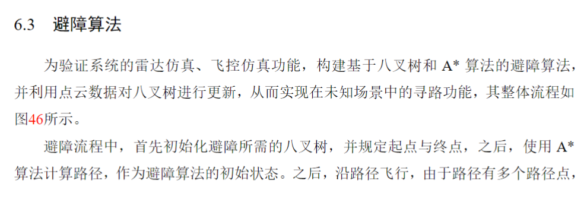
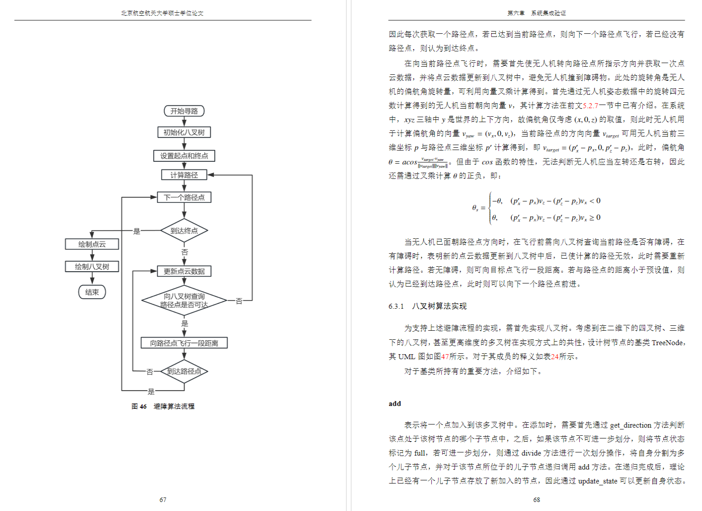
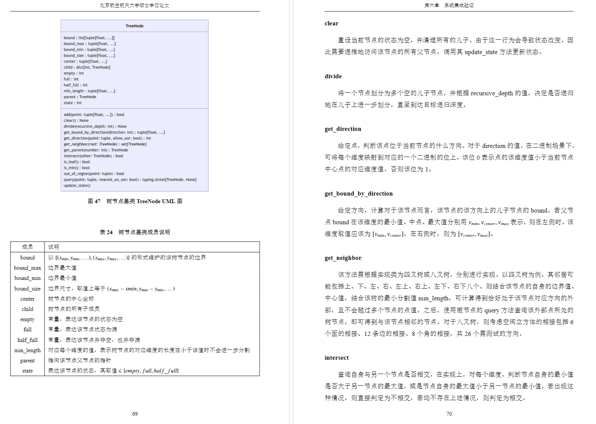
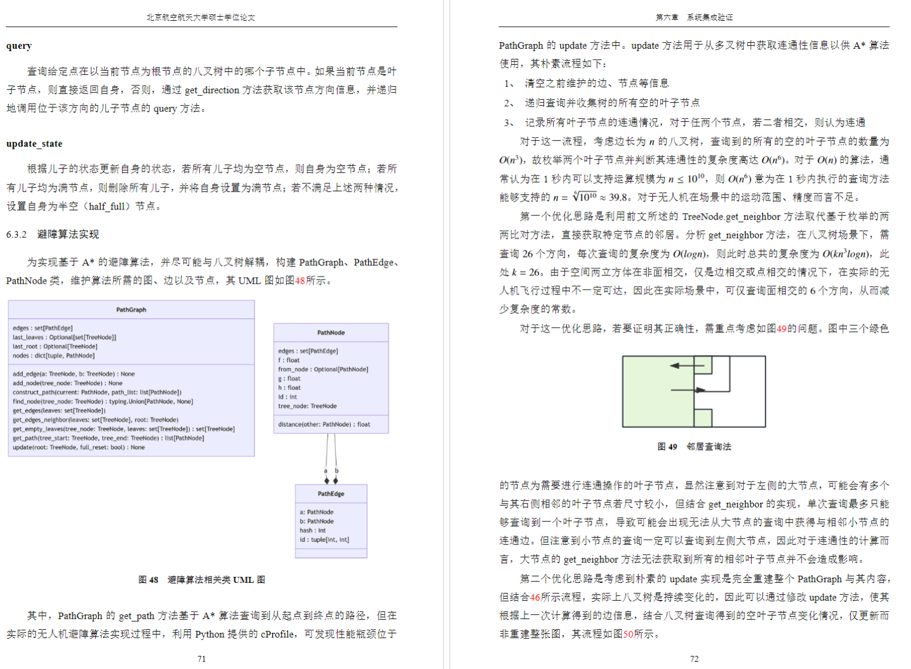
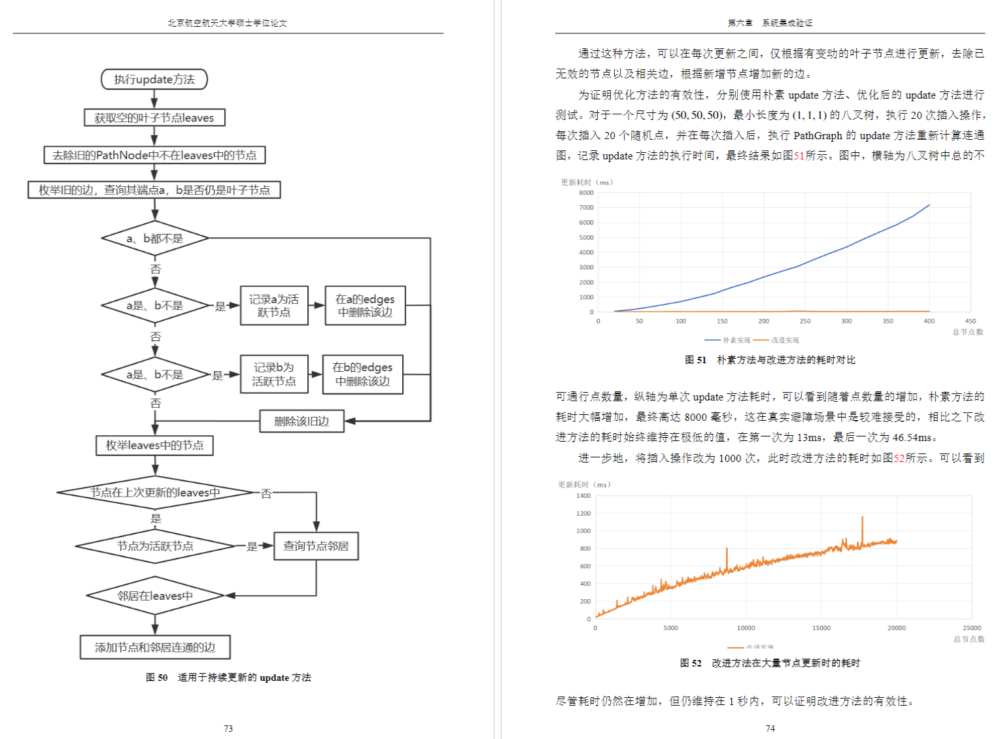
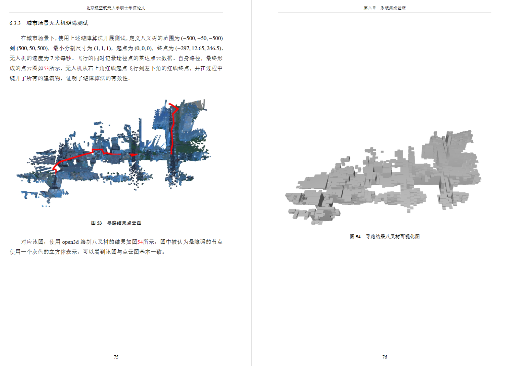

# 基于八叉树的无人机寻路算法
<iframe src="//player.bilibili.com/player.html?isOutside=true&aid=113597824895460&bvid=BV1hmi9YTEy7&cid=27186299104&p=1" scrolling="no" border="0" frameborder="no" framespacing="0" allowfullscreen="true"></iframe>

## 前置条件
1. NVIDIA显卡
2. Windows10系统，且已激活
3. 具备DX11
4. 建议Python3.11或更高
5. 已安装[./python/requirements.txt]()的依赖

## 使用方法
1. 启动[./PathFinding.exe]()
2. cd python
3. python main.py

## 说明
### [./python/tree.py]()
实现了A*算法、四叉树、八叉树
### [./python/fusion_detection.py]()
实现了一些计算机图形学变换、从深度数据与姿态数据中计算点云等操作
### [./python/drone_request.py]()
基于tcp与Unity通信获取数据，取代了部分AirSim的低效方法。
若要二次开发3D场景，可考虑自行开发与3D场景交互获取数据的功能

## 相关内容

